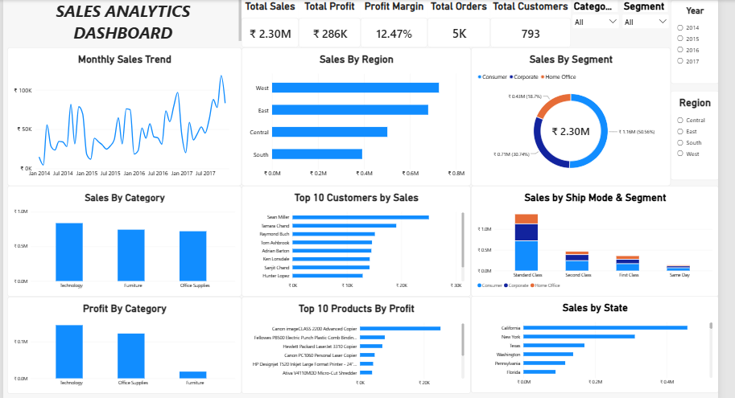
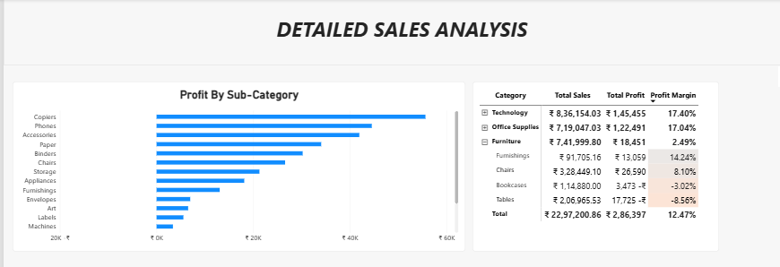

# Sales-Analytics-E2E

# 📊 Sales Analytics — End-to-End Data Analyst Project

## 📌 Project Overview

This project analyzes retail sales data to understand sales performance, profitability, customer performance, product performance, and regional trends.

The project follows an end-to-end data analytics workflow:

**Excel → MySQL → Power BI**

---

## 🎯 Business Objectives

- Analyze overall sales and profitability
- Identify top-performing categories and products
- Identify top customers by sales and profit
- Analyze regional sales performance
- Analyze monthly sales trends
- Identify loss-making products and sub-categories
- Calculate profit margins
- Build an interactive Power BI dashboard

---

## 📁 Dataset

The dataset contains **9,994 sales records** and **21 columns** covering orders, customers, products, shipping, sales, discounts, and profit.

Key fields include:

- Order ID
- Order Date
- Ship Date
- Ship Mode
- Customer ID
- Customer Name
- Segment
- Country
- City
- State
- Region
- Product ID
- Category
- Sub-Category
- Product Name
- Sales
- Quantity
- Discount
- Profit

---

## 🧹 Data Cleaning — Excel

Excel was used for initial data cleaning and validation.

Activities performed:

- Checked for duplicate records
- Checked for blank values
- Standardized Order Date and Ship Date
- Validated numeric columns
- Checked categorical values
- Verified negative profit records
- Created a cleaned dataset for SQL analysis

---

## 🗄️ SQL Analysis — MySQL

MySQL was used for data loading, validation, and business analysis.

Key SQL analyses performed:

- Overall sales, profit and quantity
- Sales by category
- Sales by region
- Sales by state
- Sales by sub-category
- Monthly sales trends
- Top 10 customers
- Top 10 products
- Loss-making products
- Profit margin analysis
- Segment analysis
- Discount analysis
- CTEs
- Subqueries
- LAG and LEAD
- RANK and DENSE_RANK
- ROW_NUMBER

---

## 📊 Power BI Dashboard

An interactive Power BI dashboard was developed using DAX measures and multiple visualizations.

### KPI Metrics

| KPI | Value |
|---|---:|
| Total Sales | ₹2.30M |
| Total Profit | ₹286K |
| Profit Margin | 12.47% |
| Total Orders | 5K |
| Total Customers | 793 |

### Dashboard Visualizations

- Monthly Sales Trend
- Sales by Region
- Sales by Segment
- Sales by Category
- Profit by Category
- Top 10 Customers by Sales
- Top 10 Products by Profit
- Sales by Ship Mode & Segment
- Sales by State
- Category and Sub-Category Matrix
- Profit by Sub-Category

### Interactive Filters

- Year
- Region
- Category
- Segment

---

## 💡 Key Business Insights

- Technology generated the highest sales among the three categories.
- Technology achieved a 17.40% profit margin.
- Office Supplies achieved a 17.04% profit margin.
- Furniture generated substantial sales but had a much lower 2.49% profit margin.
- Overall profit margin was 12.47%.
- The West region generated the highest sales among the four regions.
- Profitability varies significantly across sub-categories, including some negative-profit sub-categories.

---

## 🛠️ Tools & Technologies

- Microsoft Excel
- MySQL
- SQL
- Power BI
- DAX
- Power Query

---

## 📂 Project Files

- `Sales_Analytics_EtoE_Project.pbix` — Power BI dashboard
- `Sales_analysis-SQL.sql` — SQL analysis queries
- `Sales_Cleaned.xlsx` — cleaned dataset
- `Sales_analysis_Dashboard1.png` — dashboard screenshot
- `Sales_analysis_Dashboard2.png` — detailed analysis screenshot

---

## 📌 Skills Demonstrated

**Data Cleaning | SQL | Data Validation | Business Analysis | DAX | Power BI | Data Visualization | KPI Development | Dashboard Development | Exploratory Data Analysis**

---

## 📸 Dashboard Preview

### Sales Analytics Dashboard

### Detailed Sales Analysis

  
